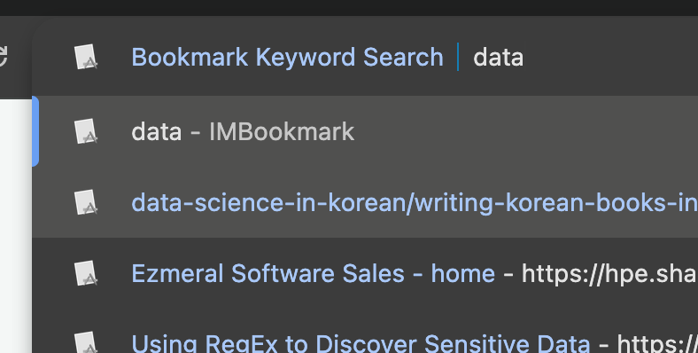

# Bookmark Keyword Search Chrome Extension

## Overview

The "Bookmark Keyword Search" is a powerful Chrome extension designed to enhance your bookmark management and search experience. It goes beyond traditional bookmarking by indexing the actual content of your saved web pages, allowing you to find information based on keywords extracted directly from the page body.

## Features

- **Intelligent Keyword Indexing:** Fetches web page content (body element), extracts the top 10 most relevant keywords, and stores them locally for powerful search capabilities.
- **Local Data Storage:** All bookmark data, including titles, URLs, indexing status, and keywords, is stored securely in your browser's local storage.
- **Omnibox Search Integration:** Quickly search your indexed bookmarks directly from Chrome's URL bar using the `myurl:` keyword. Suggestions display titles, URLs, and associated keywords.
- **Popup Search Interface:** A dedicated popup provides a user-friendly search bar. Filter results by title, URL, or keywords, see the number of matching bookmarks, and open multiple selected links at once.
- **Bookmark Management Options Page:**
  - **Import Chrome Bookmarks:** Easily import your existing Chrome bookmarks into the extension's database.
  - **Index Selected Bookmarks:** Trigger the content indexing process for chosen bookmarks.
  - **Editable Keywords:** Manually modify or add keywords for any bookmark directly in the table.
  - **Delete Selected Bookmarks:** Remove unwanted bookmarks from your extension's data.
  - **Export Bookmark Data:** Export your entire bookmark collection (including all metadata) as a JSON file for backup or transfer.
  - **Detailed Status Monitoring:** View the indexing status of each bookmark, including specific error messages for failed attempts.
- **Numbered Bookmarks & Total Count:** The options page displays numbered bookmarks and a total count for easy overview.
## Installation

To install and use this extension in Chrome:

1.  **Download the Extension Files:** If you received a `.zip` file, extract its contents to a folder on your computer (e.g., `bookmark-keyword-search`).
2.  **Open Chrome Extensions Page:**
    - Open Chrome.
    - Type `chrome://extensions` in the address bar and press Enter.
3.  **Enable Developer Mode:**
    - In the top right corner of the Extensions page, toggle on "Developer mode".
4.  **Load Unpacked Extension:**
    - Click the "Load unpacked" button that appears.
    - Navigate to and select the `bookmark-keyword-search` folder (the one containing `manifest.json` and other files).
5.  **Extension Loaded:** The extension should now appear in your list of installed extensions.

## Usage

### 1. Managing Bookmarks (Options Page)

- **Access:** Right-click on the "Bookmark Keyword Search" extension icon in your Chrome toolbar and select "Options". A new tab will open.
- **Import Chrome Bookmarks:** Click the "Import Chrome Bookmarks" button to populate the table with your existing browser bookmarks.
- **Index Bookmarks:** Select the checkboxes next to the bookmarks you want to index, then click "Index Selected Bookmarks". The extension will fetch page content and extract keywords.
- **Edit Keywords:** Click directly on a cell in the "Keywords" column to edit its content. Press `Enter` or click outside the cell to save changes.
- **Delete Bookmarks:** Select the checkboxes next to the bookmarks you wish to remove, then click "Delete Selected".
- **Export Data:** Click "Export Bookmark Data" to download a JSON file of your current extension data.

### 2. Searching Bookmarks (Popup)
 
- **Access:** Click the "Bookmark Keyword Search" extension icon in your Chrome toolbar.
- **Search:** Type your query in the search bar. Results will filter by title, URL, and extracted keywords.
- **Open Multiple:** Use the checkboxes next to the search results to select multiple bookmarks, then click "Open Selected" to open them all in new tabs.
- **Access Options:** Click the "Options" link in the top right of the popup to quickly navigate to the management page.

### 3. Omnibox Search
 

- **Activate:** In Chrome's URL bar, type `myurl:` followed by a space.
- **Search:** Begin typing your search query. Suggestions will appear, showing matching bookmarks with their titles, URLs, and keywords.
- **Navigate:** Select a suggestion and press `Enter` to open the corresponding bookmark.

## Troubleshooting

- **Extension not loading:** Ensure "Developer mode" is enabled and you selected the correct folder when using "Load unpacked". Check `chrome://extensions` for any error messages.
- **Indexing failures:** Check the "Status" column on the options page for specific error messages. Ensure the URLs are accessible.
- **Omnibox suggestions not appearing:** Ensure the extension is reloaded after any code changes. Check the background service worker's console (`chrome://extensions` -> "service worker" link under the extension) for errors.

## Future Considerations

- **LLM-powered Keyword Extraction:** Explore integrating Large Language Models (LLMs) to extract more nuanced and contextually relevant keywords from web page content, potentially improving search accuracy and relevance.

--

